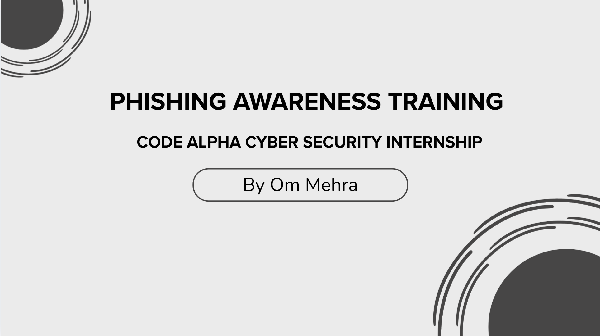
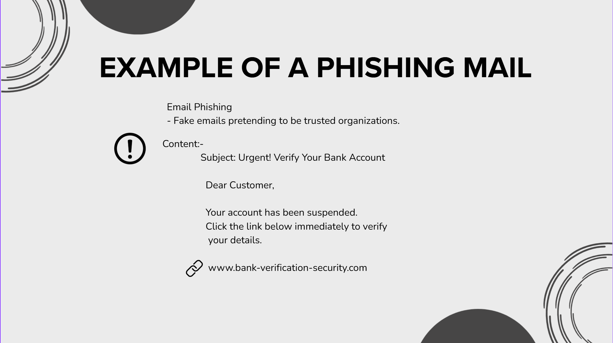
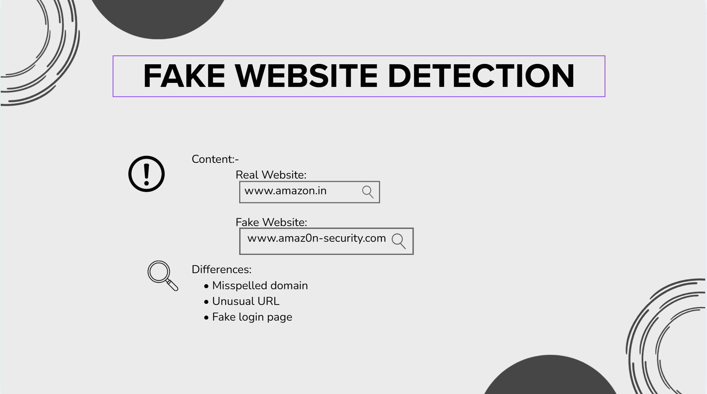
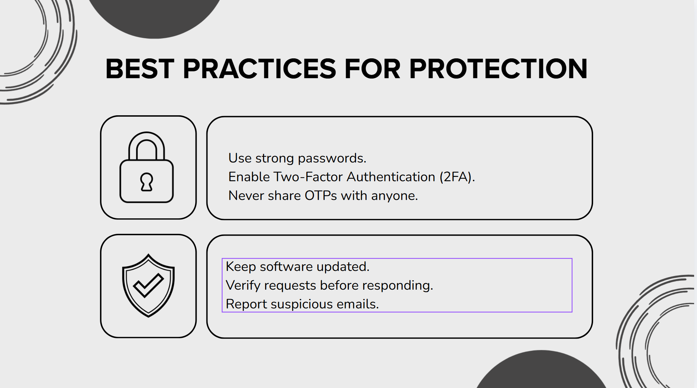

# Phishing Awareness Training

## Overview

This project was created as part of the CodeAlpha Cyber Security Internship.

The objective of this project is to educate users about phishing attacks, social engineering techniques, fake websites, and cybersecurity best practices. The presentation provides awareness about common phishing methods and explains how users can protect themselves from online threats.

---

## Topics Covered

- What is Phishing?
- Types of Phishing Attacks
- Example of a Phishing Email
- Fake Website Detection
- Social Engineering
- Real-World Phishing Example
- How to Identify Phishing Attempts
- Best Practices for Protection
- Knowledge Assessment Quiz

---

## Tools Used

- Canva
- Microsoft PowerPoint
- PDF Export

---

## Project Files

- `Phishing_Awareness_Presentation.pptx`
- `Phishing_Awareness_Presentation.pdf`

---

## Screenshots

### Title Slide

### Phishing Email Example

### Fake Website Detection

### Best Practices

---

## Learning Outcomes

Through this project, I learned:

- How phishing attacks work
- Different types of phishing techniques
- Common social engineering tactics
- Methods to identify suspicious emails and websites
- Cybersecurity best practices for online safety

---

## Author

**Om Mehra**  
CodeAlpha Cyber Security Internship
