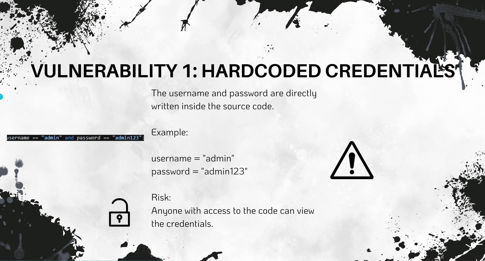
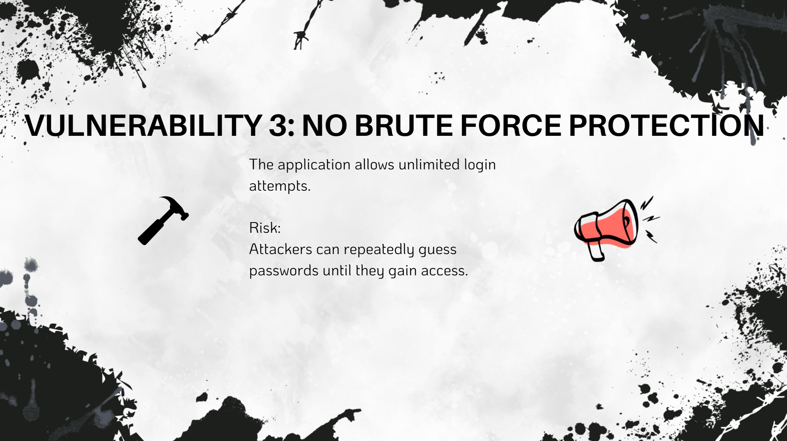
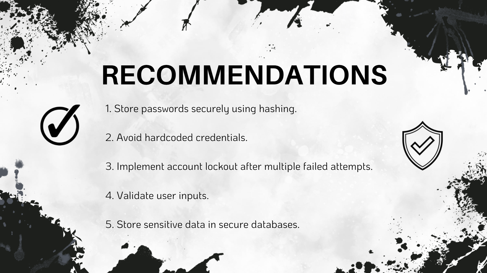

# Secure Coding Review

## Overview

This project was completed as part of the CodeAlpha Cyber Security Internship.

The objective of this project was to review a Python application for security vulnerabilities and provide recommendations to improve its security posture.

---

## Application Reviewed

* Programming Language: Python
* Application Type: Login Authentication System

---

## Vulnerabilities Identified

### 1. Hardcoded Credentials

Usernames and passwords were directly stored in the source code, making them accessible to anyone with code access.

### 2. Plaintext Password Storage

Passwords were stored in readable form instead of using secure hashing techniques.

### 3. No Brute Force Protection

The application allowed unlimited login attempts, increasing the risk of password guessing attacks.

---

## Security Recommendations

* Use password hashing algorithms such as SHA-256 or bcrypt.
* Avoid storing credentials directly in source code.
* Implement account lockout mechanisms.
* Validate user input.
* Store sensitive information securely.

---

## Tools Used

* Python
* Canva
* PowerPoint

---

## Screenshots

### Hardcoded Credentials

### Brute Force Vulnerability

### Recommendations

---

## Author

Om Mehra

CodeAlpha Cyber Security Internship
