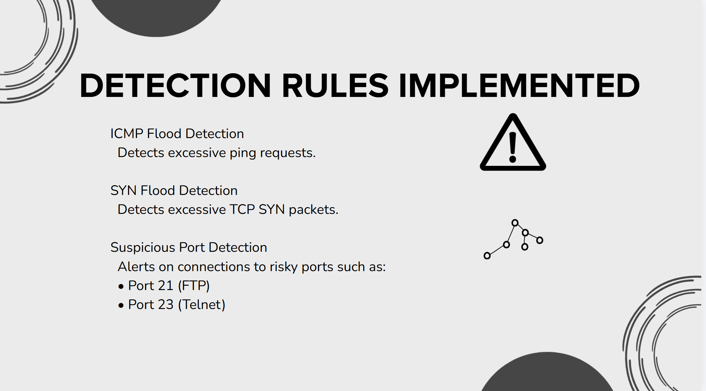
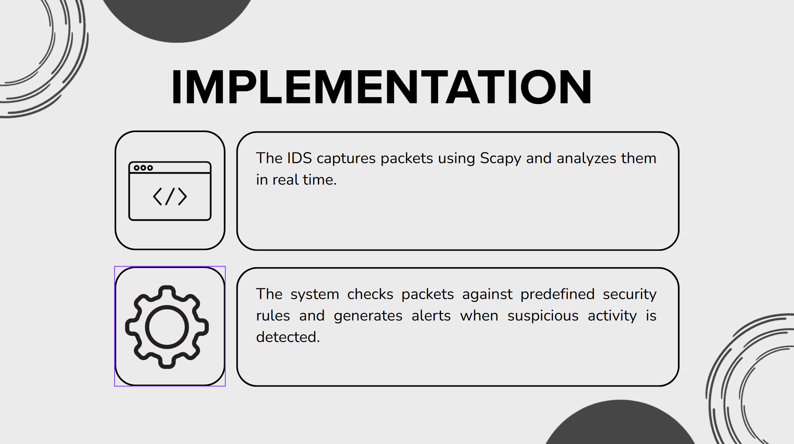
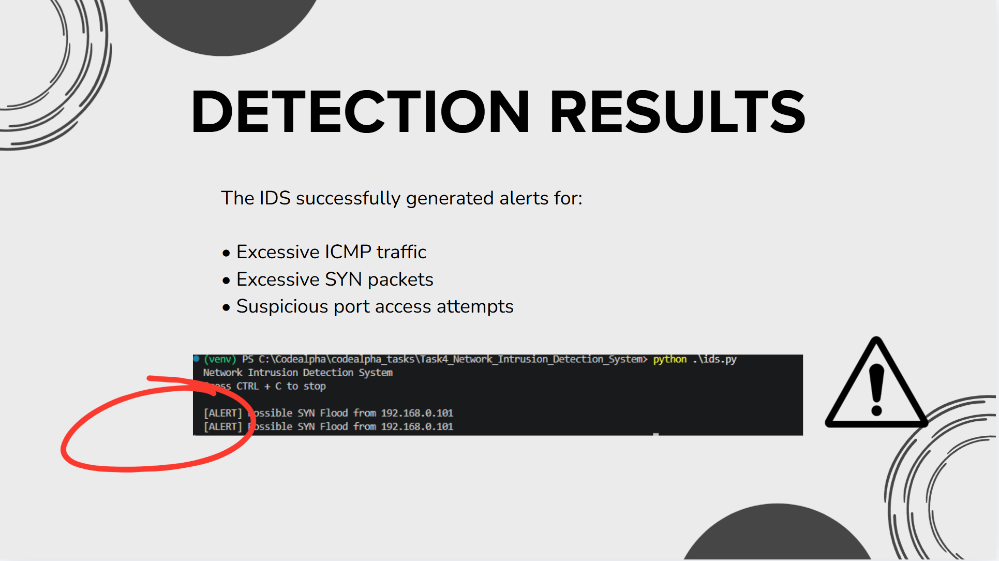

# Network Intrusion Detection System (IDS)

## Overview

This project was completed as part of the CodeAlpha Cyber Security Internship.

The objective of this project is to monitor network traffic and detect suspicious activities using a basic Intrusion Detection System (IDS) developed in Python.

---

## Features

- Real-time packet monitoring
- ICMP Flood Detection
- SYN Flood Detection
- Suspicious Port Detection
- Alert Generation
- Network Traffic Analysis

---

## Technologies Used

- Python
- Scapy
- Visual Studio Code

---

## Detection Rules

### ICMP Flood Detection
Detects excessive ICMP (Ping) packets from a single source.

### SYN Flood Detection
Detects excessive TCP SYN packets that may indicate a denial-of-service attack.

### Suspicious Port Detection
Generates warnings when traffic is detected on potentially risky ports:

- Port 21 (FTP)
- Port 23 (Telnet)

---

## Screenshots

### Detection Rules


### Implementation


### Detection Results


---

## Project Structure

```text
Task4_Network_Intrusion_Detection_System
│
├── ids.py
├── requirements.txt
├── network_ids_report.pptx
├── network_ids_report.pdf
├── README.md
└── screenshots
```

## Author

Om Mehra

CodeAlpha Cyber Security Internship